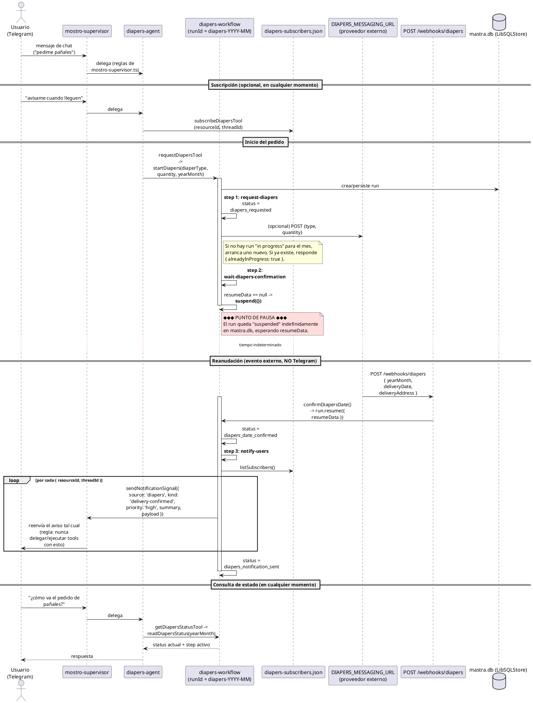
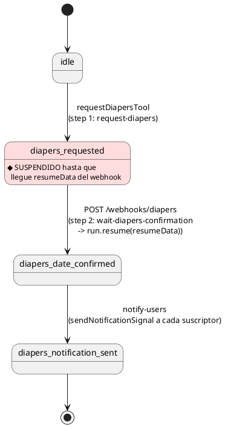

# Flujo de "diapers" (pañales)

> Nota: `pregunta.md` lista el estado como `diapers_requsted` (typo), pero el código real usa `diapers_requested`. Los demás estados coinciden: `diapers_date_confirmed`, `diapers_notification_sent`.

## 1. Diagrama de secuencia (componentes + eventos)

## 2. Diagrama de estados (máquina de estados del workflow)

## 3. Componentes involucrados

| Componente | Archivo | Rol |
|---|---|---|
| Agente | `src/mastra/agents/diapers-agent.ts` | Interpreta intención del usuario, expone 3 tools |
| Tools | `src/mastra/tools/diapers-{get-status,request,subscribe}-tool.ts` | Consultar estado, iniciar pedido, suscribirse a avisos |
| Workflow | `src/mastra/workflows/diapers/diapers.workflow.ts` | Encadena los 3 steps |
| Steps | `src/mastra/workflows/diapers/steps/*.ts` | Lógica de cada etapa |
| Helpers de ejecución | `src/mastra/lib/diapers-run.ts` | `readDiapersStatus`, `startDiapers`, `confirmDiapersDate` |
| Suscriptores | `src/mastra/lib/diapers-subscribers.ts` | JSON plano con `{resourceId, threadId}` |
| Webhook entrante | `src/mastra/routes/webhook-diapers.route.ts` | Único punto que reanuda el workflow |
| Storage | `LibSQLStore` (`mastra.db`) | Persiste estado/run del workflow |
| Supervisor | `src/mastra/agents/mostro-supervisor.ts` | Canal Telegram + delega a `diapersAgent` + reenvía notificaciones |

## 4. El punto clave: pausa y reanudación

- **Dónde se suspende**: `wait-diapers-confirmation.step.ts` — llama `await suspend({})` si no llega `resumeData`.
- **Qué lo reanuda**: exclusivamente `POST /webhooks/diapers` con `{ yearMonth, deliveryDate, deliveryAddress }` → dispara `confirmDiapersDate()` → `run.resume({ resumeData })`.
- **El usuario NO puede reanudarlo por chat** — esa etapa simula la confirmación de fecha de un proveedor/farmacia externo. Por Telegram el usuario solo puede *iniciar* el pedido (`request`) o *suscribirse* a que le avisen (`subscribe`).
- **Scope**: `runId` determinístico por mes (`diapers-YYYY-MM`) — el pedido es **compartido globalmente**, no por usuario (igual que "meds"; a diferencia de "refunds", que es por `orderId`).

## 5. Comparación rápida con los otros dos flujos análogos

| Flujo | Steps | Puntos de pausa | Scope del runId |
|---|---|---|---|
| **diapers** | 3 | 1 | por mes (`diapers-YYYY-MM`) |
| meds | 6 | 3 | por mes (`meds-YYYY-MM`) |
| refunds | 8 | 3 | por `orderId` |

Los tres comparten el mismo patrón: agente con 3 tools (`get-status`/`request`/`subscribe`), workflow Mastra con steps `wait-*` que suspenden hasta un webhook externo, steps `notify-*` que avisan a suscriptores vía `sendNotificationSignal` al supervisor, y persistencia en `LibSQLStore`.
