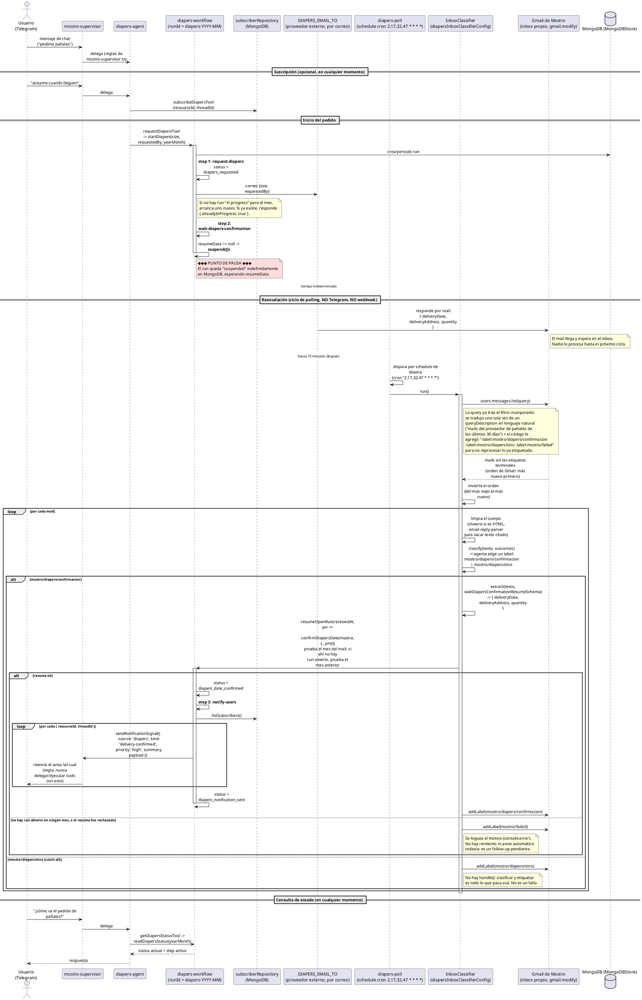
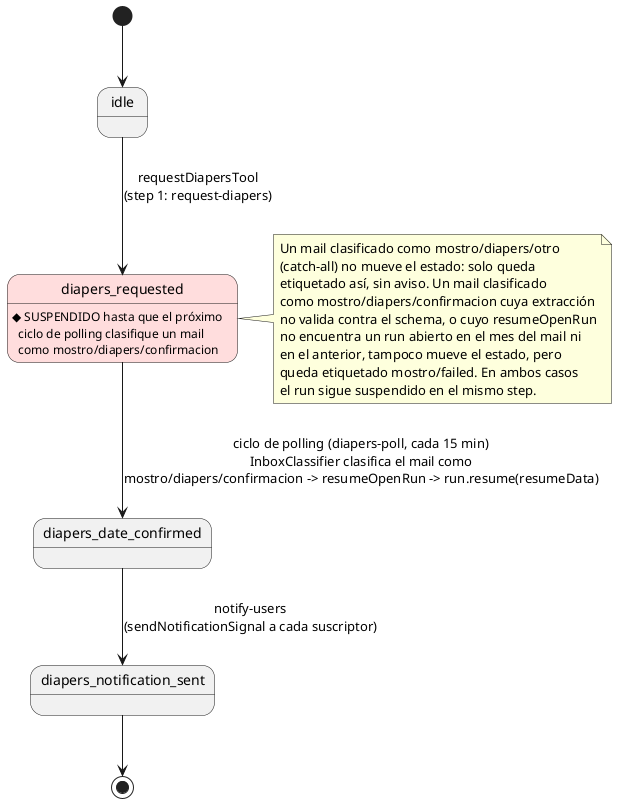

# Flujo de "diapers" (pañales)

> Nota: `pregunta.md` lista el estado como `diapers_requsted` (typo), pero el código real usa `diapers_requested`. Los demás estados coinciden: `diapers_date_confirmed`, `diapers_notification_sent`.

## 1. Diagrama de secuencia (componentes + eventos)

```plantuml
@startuml diapers-sequence
skinparam sequenceMessageAlign center
skinparam maxMessageSize 160

actor "Usuario\n(Telegram)" as User
participant "mostro-supervisor" as Supervisor
participant "diapers-agent" as Agent
participant "diapers-workflow\n(runId = diapers-YYYY-MM)" as WF
participant "subscriberRepository\n(MongoDB)" as Subs
participant "DIAPERS_EMAIL_TO\n(proveedor externo, por correo)" as Provider
participant "diapers-poll\n(schedule cron 2,17,32,47 * * * *)" as Poll
participant "InboxClassifier\n(diapersInboxClassifierConfig)" as Classifier
participant "Gmail de Mostro\n(inbox propio, gmail.modify)" as Gmail
database "MongoDB (MongoDBStore)" as DB

User -> Supervisor: mensaje de chat\n("pedime pañales")
Supervisor -> Agent: delega (reglas de mostro-supervisor.ts)

== Suscripción (opcional, en cualquier momento) ==
User -> Supervisor: "avisame cuando lleguen"
Supervisor -> Agent: delega
Agent -> Subs: subscribeDiapersTool\n(resourceId, threadId)

== Inicio del pedido ==
Agent -> WF: requestDiapersTool\n-> startDiapers(size, requestedBy, yearMonth)
activate WF
WF -> DB: crea/persiste run
WF -> WF: **step 1: request-diapers**\nstatus = diapers_requested
WF -> Provider: correo {size, requestedBy}
note right of WF
  Si no hay run "in progress" para el mes,
  arranca uno nuevo. Si ya existe, responde
  { alreadyInProgress: true }.
end note

WF -> WF: **step 2: wait-diapers-confirmation**
WF -> WF: resumeData == null -> **suspend({})**
note right of WF #FFDDDD
  ◆◆◆ PUNTO DE PAUSA ◆◆◆
  El run queda "suspended" indefinidamente
  en MongoDB, esperando resumeData.
end note
deactivate WF

... tiempo indeterminado ...

== Reanudación (ciclo de polling, NO Telegram, NO webhook) ==
Provider -> Gmail: responde por mail\n{ deliveryDate, deliveryAddress, quantity }
note right of Gmail
  El mail llega y espera en el inbox.
  Nadie lo procesa hasta el próximo ciclo.
end note

... hasta 15 minutos después ...

Poll -> Poll: dispara por schedule de Mastra\n(cron "2,17,32,47 * * * *")
Poll -> Classifier: run()
activate Classifier
Classifier -> Gmail: users.messages.list(query)
note right of Classifier
  La query ya trae el filtro incorporado:
  se tradujo una sola vez de un
  queryDescription en lenguaje natural
  ("mails del proveedor de pañales de
  los últimos 30 días") + el código le
  agregó "-label:mostro/diapers/confirmacion
  -label:mostro/diapers/otro -label:mostro/failed"
  para no reprocesar lo ya etiquetado.
end note
Gmail --> Classifier: mails sin las etiquetas terminales\n(orden de Gmail: más nuevo primero)
Classifier -> Classifier: invierte el orden\n(del más viejo al más nuevo)

loop por cada mail
  Classifier -> Classifier: limpia el cuerpo\n(cheerio si es HTML, email-reply-parser\npara sacar texto citado)
  Classifier -> Classifier: classify(texto, outcomes)\n-> agente elige un label:\nmostro/diapers/confirmacion | mostro/diapers/otro

  alt mostro/diapers/confirmacion
    Classifier -> Classifier: extract(texto, waitDiapersConfirmationResumeSchema)\n-> { deliveryDate, deliveryAddress, quantity }
    Classifier -> WF: resumeOpenRun(receivedAt, ym =>\n  confirmDiapersDate(mastra, {...ym}))\nprueba el mes del mail; si ahí no hay\nrun abierto, prueba el mes anterior
    alt resume ok
      activate WF
      WF -> WF: status = diapers_date_confirmed
      WF -> WF: **step 3: notify-users**
      WF -> Subs: listSubscribers()
      loop por cada { resourceId, threadId }
        WF -> Supervisor: sendNotificationSignal({\n  source: 'diapers', kind: 'delivery-confirmed',\n  priority: 'high', summary, payload })
        Supervisor -> User: reenvía el aviso tal cual\n(regla: nunca delegar/ejecutar tools con esto)
      end
      WF -> WF: status = diapers_notification_sent
      deactivate WF
      Classifier -> Gmail: addLabel(mostro/diapers/confirmacion)
    else no hay run abierto en ningún mes, o el resume fue rechazado
      Classifier -> Gmail: addLabel(mostro/failed)
      note right of Classifier
        Se loguea el motivo (console.error).
        No hay reintento ni aviso automático
        todavía: es un follow-up pendiente.
      end note
    end
  else mostro/diapers/otro (catch-all)
    Classifier -> Gmail: addLabel(mostro/diapers/otro)
    note right of Classifier
      No hay handle(): clasificar y etiquetar
      es todo lo que pasa acá. No es un fallo.
    end note
  end
end
deactivate Classifier

== Consulta de estado (en cualquier momento) ==
User -> Supervisor: "¿cómo va el pedido de pañales?"
Supervisor -> Agent: delega
Agent -> WF: getDiapersStatusTool -> readDiapersStatus(yearMonth)
WF --> Agent: status actual + step activo
Agent --> User: respuesta
@enduml
```

## 2. Diagrama de estados (máquina de estados del workflow)

```plantuml
@startuml diapers-state
[*] --> idle

idle --> diapers_requested : requestDiapersTool\n(step 1: request-diapers)

diapers_requested --> diapers_date_confirmed : ciclo de polling (diapers-poll, cada 15 min)\nInboxClassifier clasifica el mail como\nmostro/diapers/confirmacion -> resumeOpenRun -> run.resume(resumeData)

state diapers_requested #FFDDDD {
  diapers_requested : ◆ SUSPENDIDO hasta que el próximo\n  ciclo de polling clasifique un mail\n  como mostro/diapers/confirmacion
}

diapers_date_confirmed --> diapers_notification_sent : notify-users\n(sendNotificationSignal a cada suscriptor)

diapers_notification_sent --> [*]

note right of diapers_requested
  Un mail clasificado como mostro/diapers/otro
  (catch-all) no mueve el estado: solo queda
  etiquetado así, sin aviso. Un mail clasificado
  como mostro/diapers/confirmacion cuya extracción
  no valida contra el schema, o cuyo resumeOpenRun
  no encuentra un run abierto en el mes del mail ni
  en el anterior, tampoco mueve el estado, pero
  queda etiquetado mostro/failed. En ambos casos
  el run sigue suspendido en el mismo step.
end note
@enduml
```

## 3. Componentes involucrados

| Componente | Archivo | Rol |
|---|---|---|
| Agente | `src/mastra/agents/diapers-agent.ts` | Interpreta intención del usuario, expone 3 tools |
| Tools | `src/mastra/tools/diapers-{get-status,request,subscribe}-tool.ts` | Consultar estado, iniciar pedido, suscribirse a avisos |
| Workflow de pedido | `src/mastra/workflows/diapers/diapers.workflow.ts` | Encadena los 3 steps del pedido |
| Workflow de polling | `src/mastra/workflows/diapers-poll/diapers-poll.workflow.ts` | `schedule` cron cada 15 min; envuelve el `InboxClassifier` del dominio en un step |
| Config del classifier | `src/mastra/workflows/diapers-poll/diapers-inbox.classifier.ts` | Describe en lenguaje natural qué mails importan y qué hacer con cada outcome (`extract` + `handle`) |
| Steps | `src/mastra/workflows/diapers/steps/*.ts` | Lógica de cada etapa del pedido |
| Motor de clasificación (compartido) | `src/mastra/lib/inbox-classifier/{inbox-classifier,strip-mail-body,resume-open-run,classifier-step}.ts` | Traducir la query una vez, listar, limpiar cuerpo, clasificar, extraer si corresponde, llamar `handle`, etiquetar — compartido por diapers/meds/refunds. Qué hacer con cada outcome es 100% de cada dominio (`*-inbox.classifier.ts`) |
| Helpers de ejecución | `src/mastra/lib/diapers-run.ts` | `readDiapersStatus`, `startDiapers`, `confirmDiapersDate` — la capa de resume, sin cambios: mismo guard de run existente + suspendido + step correcto |
| Suscriptores | `src/business/repositories/subscriber.repository.ts` (`subscriberRepository`) | Lista de emails suscriptos por dominio, persistida en MongoDB |
| Storage | `MongoDBStore` (vía `MastraCompositeStore` en `src/mastra/index.ts`) | Persiste estado/run del workflow |
| Supervisor | `src/mastra/agents/mostro-supervisor.ts` | Canal Telegram + delega a `diapersAgent` + reenvía notificaciones |

## 4. El punto clave: pausa y reanudación

- **Dónde se suspende**: `wait-diapers-confirmation.step.ts` — llama `await suspend({})` si no llega `resumeData`.
- **Qué lo reanuda**: el ciclo de `diapers-poll`, cada 15 minutos, ejecutando el `InboxClassifier`
  configurado en `diapers-inbox.classifier.ts`. Busca en la casilla de Gmail de Mostro los mails que
  matchean la query traducida (que ya excluye los outcomes ya etiquetados), clasifica cada uno
  contra `mostro/diapers/confirmacion` / `mostro/diapers/otro`, y si cae en el primero extrae
  `deliveryDate`/`deliveryAddress`/`quantity` y llama `resumeOpenRun()` — que prueba el mes del mail
  y, si ahí no hay run abierto, el mes anterior — para invocar `confirmDiapersDate()` →
  `run.resume({ resumeData })`.
- **Por qué decide el código y no el modelo**: el agente clasificador solo contesta "qué es este
  mail" y, si corresponde, "con qué datos" — nunca elige a qué run ni a qué step reanudar. Eso lo
  decide `resumeOpenRun` + `confirmDiapersDate` en código. Es la misma precaución que aplica en meds
  (donde el mismo remitente manda primero un acuse y después una confirmación de entrega, y un mail
  puede leerse ambiguo entre los dos): si una mala clasificación pudiera tocar el estado del run
  directamente, un error del modelo dejaría el workflow en un estado inconsistente. En diapers hay
  un solo outcome con `handle`, así que la ambigüedad entre steps no aplica, pero el mecanismo es el
  mismo en los tres dominios.
- **El usuario NO puede reanudarlo por chat** — esa etapa simula la confirmación de fecha de un
  proveedor/farmacia externo. Por Telegram el usuario solo puede *iniciar* el pedido (`request`) o
  *suscribirse* a que le avisen (`subscribe`).
- **Mail clasificado como `mostro/diapers/otro`** (catch-all, sin `handle`): se etiqueta y no pasa
  nada más. No es un fallo — puede ser cualquier otro mail del proveedor que no encaje en la
  confirmación.
- **Mail clasificado como `mostro/diapers/confirmacion` cuya extracción no valida, o cuyo
  `resumeOpenRun` no encuentra un run abierto en ningún mes**: queda etiquetado `mostro/failed`. El
  motivo se loguea (`console.error`); no hay reintento automático ni aviso por Telegram todavía —
  ambos se rehacen con otro enfoque más adelante (ver `docs/superpowers/followups.md`).
- **Scope**: `runId` determinístico por mes (`diapers-YYYY-MM`) — el pedido es **compartido
  globalmente**, no por usuario (igual que "meds"; a diferencia de "refunds", que es por
  `orderId`).

## 5. Comparación rápida con los otros dos flujos análogos

| Flujo | Steps | Puntos de pausa | Scope del runId |
|---|---|---|---|
| **diapers** | 3 | 1 | por mes (`diapers-YYYY-MM`) |
| meds | 5 | 2 | por mes (`meds-YYYY-MM`) |
| refunds | 8 | 3 | por `orderId` |

Los tres comparten el mismo patrón: agente con 3 tools (`get-status`/`request`/`subscribe`),
workflow Mastra con steps `wait-*` que suspenden hasta que el `InboxClassifier` del dominio
(`<dominio>-poll`, cada 15 min) clasifica un mail con un outcome que tiene `handle`, steps
`notify-*` que avisan a suscriptores vía `sendNotificationSignal` al supervisor, y persistencia en
`MongoDBStore`. El motor de clasificación (`src/mastra/lib/inbox-classifier/`) es el mismo código
para los tres; lo que cambia por dominio es el `queryDescription` (en lenguaje natural) y la lista
de `outcomes`, cada uno con su `description`, su `extract` opcional y su `handle` opcional.
