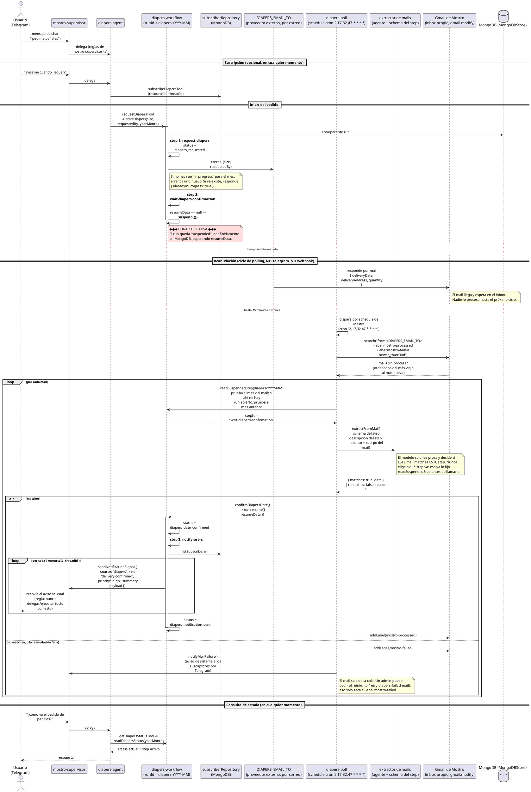
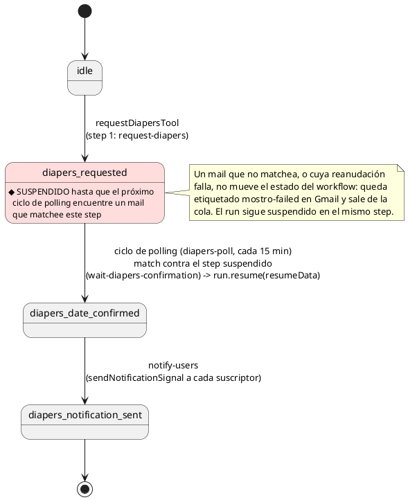

# Flujo de "diapers" (pañales)

> Nota: `pregunta.md` lista el estado como `diapers_requsted` (typo), pero el código real usa `diapers_requested`. Los demás estados coinciden: `diapers_date_confirmed`, `diapers_notification_sent`.

## 1. Diagrama de secuencia (componentes + eventos)

```plantuml
@startuml diapers-sequence
skinparam sequenceMessageAlign center
skinparam maxMessageSize 160

actor "Usuario\n(Telegram)" as User
participant "mostro-supervisor" as Supervisor
participant "diapers-agent" as Agent
participant "diapers-workflow\n(runId = diapers-YYYY-MM)" as WF
participant "subscriberRepository\n(MongoDB)" as Subs
participant "DIAPERS_EMAIL_TO\n(proveedor externo, por correo)" as Provider
participant "diapers-poll\n(schedule cron 2,17,32,47 * * * *)" as Poll
participant "extractor de mails\n(agente + schema del step)" as Extractor
participant "Gmail de Mostro\n(inbox propio, gmail.modify)" as Gmail
database "MongoDB (MongoDBStore)" as DB

User -> Supervisor: mensaje de chat\n("pedime pañales")
Supervisor -> Agent: delega (reglas de mostro-supervisor.ts)

== Suscripción (opcional, en cualquier momento) ==
User -> Supervisor: "avisame cuando lleguen"
Supervisor -> Agent: delega
Agent -> Subs: subscribeDiapersTool\n(resourceId, threadId)

== Inicio del pedido ==
Agent -> WF: requestDiapersTool\n-> startDiapers(size, requestedBy, yearMonth)
activate WF
WF -> DB: crea/persiste run
WF -> WF: **step 1: request-diapers**\nstatus = diapers_requested
WF -> Provider: correo {size, requestedBy}
note right of WF
  Si no hay run "in progress" para el mes,
  arranca uno nuevo. Si ya existe, responde
  { alreadyInProgress: true }.
end note

WF -> WF: **step 2: wait-diapers-confirmation**
WF -> WF: resumeData == null -> **suspend({})**
note right of WF #FFDDDD
  ◆◆◆ PUNTO DE PAUSA ◆◆◆
  El run queda "suspended" indefinidamente
  en MongoDB, esperando resumeData.
end note
deactivate WF

... tiempo indeterminado ...

== Reanudación (ciclo de polling, NO Telegram, NO webhook) ==
Provider -> Gmail: responde por mail\n{ deliveryDate, deliveryAddress, quantity }
note right of Gmail
  El mail llega y espera en el inbox.
  Nadie lo procesa hasta el próximo ciclo.
end note

... hasta 15 minutos después ...

Poll -> Poll: dispara por schedule de Mastra\n(cron "2,17,32,47 * * * *")
Poll -> Gmail: search("from:<DIAPERS_EMAIL_TO>\n-label:mostro-processed -label:mostro-failed\nnewer_than:30d")
Gmail --> Poll: mails sin procesar\n(ordenados del más viejo al más nuevo)

loop por cada mail
  Poll -> WF: readSuspendedStep(diapers-YYYY-MM)\nprueba el mes del mail; si ahí no hay\nrun abierto, prueba el mes anterior
  WF --> Poll: stepId = "wait-diapers-confirmation"
  Poll -> Extractor: extractFromMail(\n  schema del step, descripción del step,\n  asunto + cuerpo del mail)
  note right of Extractor
    El modelo solo lee prosa y decide si
    ESTE mail matchea ESTE step. Nunca
    elige a qué step va: eso ya lo fijó
    readSuspendedStep antes de llamarlo.
  end note
  Extractor --> Poll: { matches: true, data }\n| { matches: false, reason }

  alt matches
    Poll -> WF: confirmDiapersDate()\n-> run.resume({ resumeData })
    activate WF
    WF -> WF: status = diapers_date_confirmed
    WF -> WF: **step 3: notify-users**
    WF -> Subs: listSubscribers()
    loop por cada { resourceId, threadId }
      WF -> Supervisor: sendNotificationSignal({\n  source: 'diapers', kind: 'delivery-confirmed',\n  priority: 'high', summary, payload })
      Supervisor -> User: reenvía el aviso tal cual\n(regla: nunca delegar/ejecutar tools con esto)
    end
    WF -> WF: status = diapers_notification_sent
    deactivate WF
    Poll -> Gmail: addLabel(mostro-processed)
  else no matchea, o la reanudación falla
    Poll -> Gmail: addLabel(mostro-failed)
    Poll -> Supervisor: notifyMailFailure()\n(aviso de sistema a los suscriptores por Telegram)
    note right of Poll
      El mail sale de la cola. Un admin puede
      pedir el reintento (retry-diapers-failed-mail);
      eso solo saca el label mostro-failed.
    end note
  end
end

== Consulta de estado (en cualquier momento) ==
User -> Supervisor: "¿cómo va el pedido de pañales?"
Supervisor -> Agent: delega
Agent -> WF: getDiapersStatusTool -> readDiapersStatus(yearMonth)
WF --> Agent: status actual + step activo
Agent --> User: respuesta
@enduml
```

## 2. Diagrama de estados (máquina de estados del workflow)

```plantuml
@startuml diapers-state
[*] --> idle

idle --> diapers_requested : requestDiapersTool\n(step 1: request-diapers)

diapers_requested --> diapers_date_confirmed : ciclo de polling (diapers-poll, cada 15 min)\nmatch contra el step suspendido\n(wait-diapers-confirmation) -> run.resume(resumeData)

state diapers_requested #FFDDDD {
  diapers_requested : ◆ SUSPENDIDO hasta que el próximo\n  ciclo de polling encuentre un mail\n  que matchee este step
}

diapers_date_confirmed --> diapers_notification_sent : notify-users\n(sendNotificationSignal a cada suscriptor)

diapers_notification_sent --> [*]

note right of diapers_requested
  Un mail que no matchea, o cuya reanudación
  falla, no mueve el estado del workflow: queda
  etiquetado mostro-failed en Gmail y sale de la
  cola. El run sigue suspendido en el mismo step.
end note
@enduml
```

## 3. Componentes involucrados

| Componente | Archivo | Rol |
|---|---|---|
| Agente | `src/mastra/agents/diapers-agent.ts` | Interpreta intención del usuario, expone 4 tools |
| Tools | `src/mastra/tools/diapers-{get-status,request,subscribe,retry-failed-mail}-tool.ts` | Consultar estado, iniciar pedido, suscribirse a avisos, reintentar mail fallido (admin) |
| Workflow de pedido | `src/mastra/workflows/diapers/diapers.workflow.ts` | Encadena los 3 steps del pedido |
| Workflow de polling | `src/mastra/workflows/diapers-poll/diapers-poll.workflow.ts` | `schedule` cron cada 15 min; declara qué step espera qué schema/descripción |
| Steps | `src/mastra/workflows/diapers/steps/*.ts` | Lógica de cada etapa del pedido |
| Motor de polling (compartido) | `src/mastra/lib/inbox/{gmail-reader,mail-extractor,poll-mailbox,poll-step,notify-mail-failure,retry-failed-mails}.ts` | Buscar mails, extraer campos, resolver el run/step abierto, etiquetar, avisar fallos — compartido por diapers/meds/refunds |
| Helpers de ejecución | `src/mastra/lib/diapers-run.ts` | `readDiapersStatus`, `startDiapers`, `confirmDiapersDate` — la capa de resume, sin cambios: mismo guard de run existente + suspendido + step correcto |
| Suscriptores | `src/business/repositories/subscriber.repository.ts` (`subscriberRepository`) | Lista de emails suscriptos por dominio, persistida en MongoDB |
| Storage | `MongoDBStore` (vía `MastraCompositeStore` en `src/mastra/index.ts`) | Persiste estado/run del workflow |
| Supervisor | `src/mastra/agents/mostro-supervisor.ts` | Canal Telegram + delega a `diapersAgent` + reenvía notificaciones (incluidos avisos de mail fallido) |

## 4. El punto clave: pausa y reanudación

- **Dónde se suspende**: `wait-diapers-confirmation.step.ts` — llama `await suspend({})` si no llega `resumeData`.
- **Qué lo reanuda**: el ciclo de `diapers-poll`, cada 15 minutos. Busca en la casilla de Gmail de
  Mostro los mails de `DIAPERS_EMAIL_TO` sin etiquetar, lee en qué step está suspendido el run del
  mes (o, si ahí no hay nada abierto, el del mes anterior), y solo entonces le pregunta al
  extractor si ESE mail matchea ESE step. Si matchea, llama `confirmDiapersDate()` →
  `run.resume({ resumeData })`, igual que antes.
- **Por qué decide el step y no el modelo**: el extractor solo lee prosa y devuelve campos; nunca
  elige a qué step reanudar. Eso ya lo fijó `readSuspendedStep` antes de invocarlo. Es la misma
  precaución que aplica en meds (donde el mismo remitente manda primero un acuse y después una
  confirmación de entrega, y un mail puede leerse ambiguo entre los dos): si el LLM eligiera la
  etapa, un error de clasificación reanudaría el step equivocado. En diapers hay un solo punto de
  pausa, así que la ambigüedad entre steps no aplica, pero el mecanismo es el mismo en los tres
  dominios.
- **El usuario NO puede reanudarlo por chat** — esa etapa simula la confirmación de fecha de un
  proveedor/farmacia externo. Por Telegram el usuario solo puede *iniciar* el pedido (`request`),
  *suscribirse* a que le avisen (`subscribe`), o —si es admin— pedir el reintento de un mail
  fallido (`retry-diapers-failed-mail`), que le saca el label `mostro-failed` para que el próximo
  ciclo lo levante.
- **Mail que no matchea o falla**: queda etiquetado `mostro-failed` y sale de la cola; se avisa por
  Telegram a los suscriptores del dominio. Si el mail fallido tiene más de 30 días, cae fuera de la
  ventana de búsqueda (`newer_than:30d`) y el reintento no lo destraba solo: el tool lo cuenta
  aparte y avisa que hay que revisarlo a mano en Gmail.
- **Scope**: `runId` determinístico por mes (`diapers-YYYY-MM`) — el pedido es **compartido
  globalmente**, no por usuario (igual que "meds"; a diferencia de "refunds", que es por
  `orderId`).

## 5. Comparación rápida con los otros dos flujos análogos

| Flujo | Steps | Puntos de pausa | Scope del runId |
|---|---|---|---|
| **diapers** | 3 | 1 | por mes (`diapers-YYYY-MM`) |
| meds | 6 | 3 | por mes (`meds-YYYY-MM`) |
| refunds | 8 | 3 | por `orderId` |

Los tres comparten el mismo patrón: agente con 4 tools (`get-status`/`request`/`subscribe`/`retry-failed-mail`),
workflow Mastra con steps `wait-*` que suspenden hasta que el ciclo de polling del dominio
(`<dominio>-poll`, cada 15 min) encuentra y matchea un mail, steps `notify-*` que avisan a
suscriptores vía `sendNotificationSignal` al supervisor, y persistencia en `MongoDBStore`. El
motor de polling (`src/mastra/lib/inbox/`) es el mismo código para los tres; lo que cambia por
dominio es el remitente esperado, el `workflowId`, y el mapa de step → schema/descripción.
