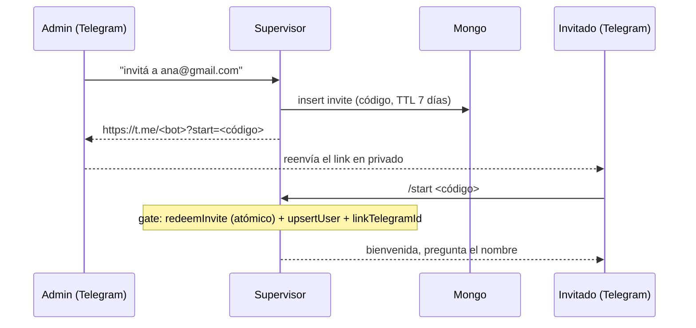

# Identidad y control de acceso

Cómo funciona la capa de usuarios, invitaciones y autorización. Para las decisiones de diseño y alternativas descartadas, ver los specs (`superpowers/specs/2026-07-21-user-identity-design.md` y `2026-07-22-canonical-identity-design.md`); este documento describe el estado actual.

## Modelo

La identidad canónica de una persona es su **email de Google** (lowercase). Todo lo demás son identidades vinculadas o derivadas:

```
email (canónico, colección users)
├── telegramId     identidad vinculada — se setea al canjear un invite (o por seed)
└── resourceId     dueño de la memoria del agente — email en threads nuevos de DM
```

La colección `users` en Mongo (`src/mastra/lib/users.ts`):

| Campo        | Tipo                  | Notas                                            |
| ------------ | --------------------- | ------------------------------------------------ |
| `email`      | string                | Canónico, lowercase. Índice único.               |
| `name`       | string                | Editable vía `setMyNameTool`.                    |
| `role`       | `'admin' \| 'member'` | Solo admins invitan.                             |
| `telegramId` | string (opcional)     | Índice único sparse: un telegram, un solo user.  |
| `addedAt`    | number (unix)         |                                                  |

**Estar en `users` = estar autorizado**, para el bot de Telegram y para la web por igual. No hay allowlists paralelas.

## Boot: seed del admin

`ensureAdminSeed()` corre en cada arranque (`index.ts`): crea los índices únicos de forma idempotente y, si `ADMIN_EMAIL` está seteado, upserta al admin con `role: 'admin'`. `ADMIN_TELEGRAM_ID` se re-aplica en cada boot; `ADMIN_NAME` solo se usa al crear (`$setOnInsert` — cambiarlo después en `.env` es un no-op). Sin `ADMIN_EMAIL` el seed se saltea con un warning y nadie queda autorizado.

## Acceso por Telegram: el gate

`createTelegramGate()` (`src/mastra/lib/telegram-gate.ts`) corre **antes** de que el mensaje llegue al agente, en los tres caminos de entrada del canal (`onDirectMessage`, `onMention`, `onSubscribedMessage`). Un desconocido no gasta tokens ni toca memoria:

1. Si el `telegramId` del remitente matchea un user → pasa al agente.
2. Si no, solo se considera un mensaje `/start <código>` (deep link de invite). Cualquier otra cosa se ignora **en silencio**.
3. El canje es atómico (`findOneAndUpdate`: sin usar + vigente → marcado usado); de dos canjes concurrentes uno gana y el otro recibe null.
4. El canje vincula el `telegramId` al user del invite y recién ahí el mensaje pasa al agente.

## Invitaciones

Solo admins, por chat: el supervisor usa `createInviteTool` con el email de Google del invitado (nombre opcional).



Detalles:

- El user se crea **al canjear el invite** (vía Telegram `/start`), no al generar el invite: solo después de redimir el invite puede loguearse a la web con su Google.
- El invite es de un solo uso y vence a los 7 días (`INVITE_TTL_SECONDS`).
- Quien abre el link se convierte en esa persona (se vincula su `telegramId` al email del invite) — por eso el link se manda en privado.
- Si el canje sucede pero no matchea ningún invite válido, el gate loguea un warning y no deja pasar; el código queda quemado y el admin regenera el invite.

## Acceso web: Google SSO

`createGoogleAuth()` (`src/mastra/lib/google-auth.ts`) monta `MastraAuthGoogle` sobre el server de Mastra. La autorización es `authorizeUser`: email verificado por Google **y presente en `users`** — la misma condición que el bot, sin listas aparte. Sin `GOOGLE_CLIENT_ID`/`GOOGLE_CLIENT_SECRET` el auth queda deshabilitado con un warning (útil en dev).

**Nota:** El acceso web solo funciona **después de canjear el invite** por Telegram. El invite no pre-crea el user; la redención es el momento donde se crea el user, se vincula el Telegram, y a partir de ese punto el email queda autorizado para la web.

Excepción: el webhook del canal Telegram (`/api/agents/*/channels/telegram/webhook`) queda público porque ya tiene su propia protección (`TELEGRAM_WEBHOOK_SECRET_TOKEN`) — si el middleware de auth lo tapara, el bot muere.

## Memoria: resourceIds

Quién es "dueño" de la memoria de cada conversación:

- **Default de channels**: `telegram:<userId>`. Sigue siendo el fallback (grupos, y fail-safe si el resolver no encuentra al user).
- **`resolveResourceId`** (en el supervisor): en threads **nuevos** de DM resuelve el `telegramId` del remitente al email canónico. Corre solo al crear el thread; los threads existentes conservan su dueño. Consecuencia: la memoria queda a nombre del email y una futura web comparte memoria con el bot sin migración.
- **Sub-agentes**: Mastra deriva el resourceId hijo como `{resourceId}-{agentKey}` (ej. `ana@gmail.com-diapersAgent`), con thread nuevo por delegación. Es comportamiento del framework, documentado y estable.
- **Des-derivado**: las tools que corren dentro de un sub-agente ven el id sufijado, pero necesitan al user (p. ej. para `requestedBy`). `stripSubAgentSuffix` (`users.ts`) recorta el sufijo comparando contra la lista de keys registradas en `lib/sub-agent-keys.ts` — no contra una convención de naming. El `satisfies Record<SubAgentKey, Agent>` del supervisor obliga en compilación a que la lista y el registro no se desincronicen. Un sufijo desconocido no se recorta: la búsqueda de user falla visible en vez de manglar el id en silencio.

## Variables de entorno

| Variable                 | Requerida | Rol                                                                  |
| ------------------------ | --------- | -------------------------------------------------------------------- |
| `ADMIN_EMAIL`            | sí*       | Email del admin a seedear. Sin ella, nadie queda autorizado.          |
| `ADMIN_NAME`             | no        | Nombre del admin. Solo se aplica al crear el user.                    |
| `ADMIN_TELEGRAM_ID`      | no        | Vincula el Telegram del admin sin pasar por un invite.                |
| `GOOGLE_CLIENT_ID`       | no        | OAuth client (tipo "Web application"). Sin él, auth web deshabilitado.|
| `GOOGLE_CLIENT_SECRET`   | no        | Idem.                                                                 |
| `GOOGLE_REDIRECT_URI`    | no        | `https://<NGROK_DOMAIN>/api/auth/sso/callback`                        |
| `GOOGLE_COOKIE_PASSWORD` | no        | 32+ chars, firma la cookie de sesión.                                 |

\* Opcional para el schema de zod, pero en la práctica obligatoria: sin admin no hay quien invite. Ojo: ninguna de estas variables puede estar presente **con valor vacío** — zod valida `min(...)` y rompe el boot.

## Limitaciones conocidas

Ver `superpowers/followups.md` para la lista viva. Las relevantes a esta capa: el gate compara contra `users.telegramId` pero está registrado a nivel `channels.handlers` (un futuro adapter no-Telegram quedaría bloqueado fail-closed); cambio de email de un usuario = migración manual; sin revocación de usuarios ni roles finos todavía.
