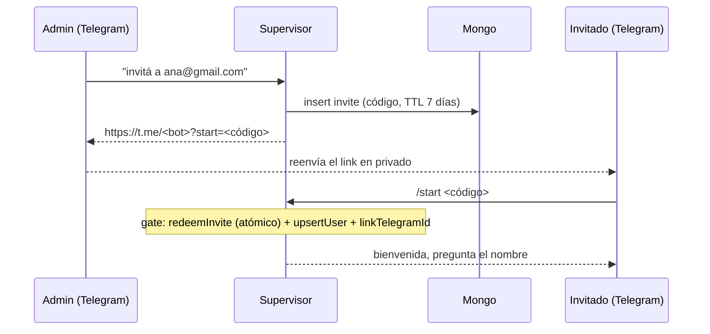

# Identidad y control de acceso

Cómo funciona la capa de usuarios, invitaciones y autorización. Para las decisiones de diseño y alternativas descartadas, ver los specs (`superpowers/specs/2026-07-21-user-identity-design.md` y `2026-07-22-canonical-identity-design.md`); este documento describe el estado actual.

## Modelo

La identidad canónica de una persona es su **email de Google** (lowercase). Todo lo demás son identidades vinculadas o derivadas:

```
email (canónico, colección users)
├── telegramId     identidad vinculada — se setea al canjear un invite (o por seed)
└── resourceId     dueño de la memoria del agente — email en threads nuevos de DM
```

La colección `users` en Mongo (`src/mastra/lib/users.ts`):

| Campo        | Tipo                  | Notas                                            |
| ------------ | --------------------- | ------------------------------------------------ |
| `email`      | string                | Canónico, lowercase. Índice único.               |
| `name`       | string                | Editable vía `setMyNameTool`.                    |
| `role`       | `'admin' \| 'member'` | Solo admins invitan.                             |
| `telegramId` | string (opcional)     | Índice único sparse: un telegram, un solo user.  |
| `addedAt`    | number (unix)         |                                                  |

**Estar en `users` = estar autorizado**, para el bot de Telegram y para la web por igual. No hay allowlists paralelas.

## Boot: seed del admin

`ensureAdminSeed()` corre en cada arranque (`index.ts`): crea los índices únicos de forma idempotente y, si `ADMIN_EMAIL` está seteado, upserta al admin con `role: 'admin'`. `ADMIN_TELEGRAM_ID` se re-aplica en cada boot; `ADMIN_NAME` solo se usa al crear (`$setOnInsert` — cambiarlo después en `.env` es un no-op). Sin `ADMIN_EMAIL` el seed se saltea con un warning y nadie queda autorizado.

## Acceso por Telegram: el gate

`createTelegramGate()` (`src/mastra/lib/telegram-gate.ts`) corre **antes** de que el mensaje llegue al agente, en los tres caminos de entrada del canal (`onDirectMessage`, `onMention`, `onSubscribedMessage`). Un desconocido no gasta tokens ni toca memoria:

1. Si el `telegramId` del remitente matchea un user → pasa al agente.
2. Si no, solo se considera un mensaje `/start <código>` (deep link de invite). Cualquier otra cosa se ignora **en silencio**.
3. El canje es atómico (`findOneAndUpdate`: sin usar + vigente → marcado usado); de dos canjes concurrentes uno gana y el otro recibe null.
4. El canje vincula el `telegramId` al user del invite y recién ahí el mensaje pasa al agente.

## Invitaciones

Solo admins, por chat: el supervisor usa `createInviteTool` con el email de Google del invitado. El tool ya no recibe nombre (se toma del perfil de Google en el primer login web); devuelve un link `t.me/...?start=<código>` que el admin le reenvía en privado al invitado.


```mermaid
sequenceDiagram
    participant A as Admin (Telegram)
    participant S as Supervisor
    participant M as Mongo
    participant I as Invitado (Telegram)
    A->>S: "invitá a ana@gmail.com"
    S->>M: insert invite (código, TTL 7 días)
    S-->>A: https://t.me/<bot>?start=<código>
    A-->>I: reenvía el link en privado
    I->>S: /start <código>
    Note over S: gate: redeemInvite (atómico) + upsertUser + linkTelegramId
    S-->>I: bienvenida, pregunta el nombre
```

Detalles:

- El user se crea **al canjear el invite** (vía Telegram `/start`), no al generar el invite: solo después de redimir el invite puede loguearse a la web con su Google.
- El invite es de un solo uso y vence a los 7 días (`INVITE_TTL_SECONDS`).
- Quien abre el link se convierte en esa persona (se vincula su `telegramId` al email del invite) — por eso el link se manda en privado.
- Si el código no matchea ningún invite válido (vencido, ya usado, inexistente), no se quema nada: el bot responde con el mensaje genérico de invitación inválida.
- Si el canje sí matchea pero falla la provisión del user (p. ej. Mongo caído), el código **ya quedó quemado** por el `findOneAndUpdate` atómico; el bot le avisa al invitado que pida un link nuevo (mensaje de error de activación) y un admin tiene que generarle otra invitación.

## Acceso web: JWT firmado por mostro-web

El login con Google vive **afuera**, en mostro-web: ahí Auth.js verifica la identidad y su BFF firma un JWT corto (HS256, ~5 min) con el email como claim. Mostro no habla con Google ni tiene login propio; sólo recibe ese bearer.

`createJwtAuth()` (`src/mastra/lib/jwt-auth.ts`) monta `MastraJwtAuth` con `MOSTRO_JWT_SECRET`, el secreto compartido que es el trust anchor entre los dos servicios. La firma prueba *quién* es, no *si puede entrar*: eso lo decide `authorizeUser` con `assertInvitedAndSyncName`, que exige que el email exista en `users` — la misma condición que el bot, sin listas aparte. Es la pieza que importa, porque mostro-web hoy le da sesión a cualquier cuenta de Google; el allowlist corta acá. Sin `MOSTRO_JWT_SECRET` el provider no se crea y queda un warning.

El `resourceId` de la memoria se mapea al email, igual que el bot, así que un usuario ve la misma conversación desde Telegram y desde la web.

**Ojo, hay dos integraciones de Google en el proyecto y no comparten credenciales.** El login web usa las credenciales OAuth de mostro-web (`AUTH_GOOGLE_*`, en ese repo). El envío de correos a proveedores usa `GMAIL_MAILER_*`, otro cliente OAuth (puede vivir en el mismo proyecto de Google Cloud). Quien se loguea nunca ve un pedido de acceso a Gmail: el consentimiento es por los scopes de cada solicitud, y el login solo pide `openid email profile`. El detalle está en el README.

**Nota:** El acceso web solo funciona **después de canjear el invite** por Telegram. El invite no pre-crea el user; la redención es el momento donde se crea el user, se vincula el Telegram, y a partir de ese punto el email queda autorizado para la web.

Excepción: el webhook del canal Telegram (`/api/agents/*/channels/telegram/webhook`) queda público porque ya tiene su propia protección (`TELEGRAM_WEBHOOK_SECRET_TOKEN`) — si el middleware de auth lo tapara, el bot muere.

## Memoria: resourceIds

Quién es "dueño" de la memoria de cada conversación:

- **Default de channels**: `telegram:<userId>`. Sigue siendo el fallback (grupos, y fail-safe si el resolver no encuentra al user).
- **`resolveResourceId`** (en el supervisor): en threads **nuevos** de DM resuelve el `telegramId` del remitente al email canónico. Corre solo al crear el thread; los threads existentes conservan su dueño. Consecuencia: la memoria queda a nombre del email y una futura web comparte memoria con el bot sin migración.
- **Sub-agentes**: Mastra deriva el resourceId hijo como `{resourceId}-{agentKey}` (ej. `ana@gmail.com-diapersAgent`), con thread nuevo por delegación. Es comportamiento del framework, documentado y estable.
- **Des-derivado**: las tools que corren dentro de un sub-agente ven el id sufijado, pero necesitan al user (p. ej. para `requestedBy`). `stripSubAgentSuffix` (`users.ts`) recorta el sufijo comparando contra la lista de keys registradas en `lib/sub-agent-keys.ts` — no contra una convención de naming. El `satisfies Record<SubAgentKey, Agent>` del supervisor obliga en compilación a que la lista y el registro no se desincronicen. Un sufijo desconocido no se recorta: la búsqueda de user falla visible en vez de manglar el id en silencio.

## Variables de entorno

Solo las de identidad. Las del envío de correos (`GMAIL_MAILER_*`, `*_EMAIL_TO`) están en el README.

| Variable                     | Requerida | Rol                                                                   |
| ---------------------------- | --------- | --------------------------------------------------------------------- |
| `ADMIN_EMAIL`                | sí*       | Email del admin a seedear. Sin ella, nadie queda autorizado.           |
| `ADMIN_NAME`                 | no        | Nombre del admin. Solo se aplica al crear el user.                     |
| `ADMIN_TELEGRAM_ID`          | no        | Vincula el Telegram del admin sin pasar por un invite.                 |
| `MOSTRO_JWT_SECRET`          | no†       | 32+ chars. Secreto compartido con el BFF de mostro-web, que firma el JWT de cada request. Sin él, acceso web deshabilitado. |
| `STUDIO_API_KEY`             | no†       | 32+ chars. Token de admin para Studio (ver `docs/studio-prod.md`).      |

\* Opcional para el schema de zod, pero en la práctica obligatoria: sin admin no hay quien invite. Ojo: ninguna de estas variables puede estar presente **con valor vacío** — zod valida `min(...)` y rompe el boot.

† Individualmente opcionales, pero **al menos una** tiene que estar: sin ningún provider el server quedaría abierto, así que `createServerAuth()` corta el boot.

## Limitaciones conocidas

Ver `superpowers/followups.md` para la lista viva. Las relevantes a esta capa: el gate compara contra `users.telegramId` pero está registrado a nivel `channels.handlers` (un futuro adapter no-Telegram quedaría bloqueado fail-closed); cambio de email de un usuario = migración manual; sin revocación de usuarios ni roles finos todavía.
