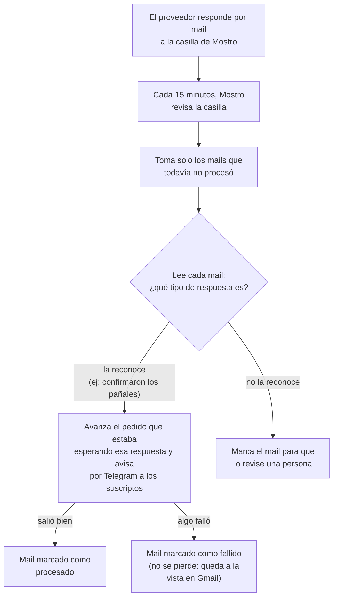
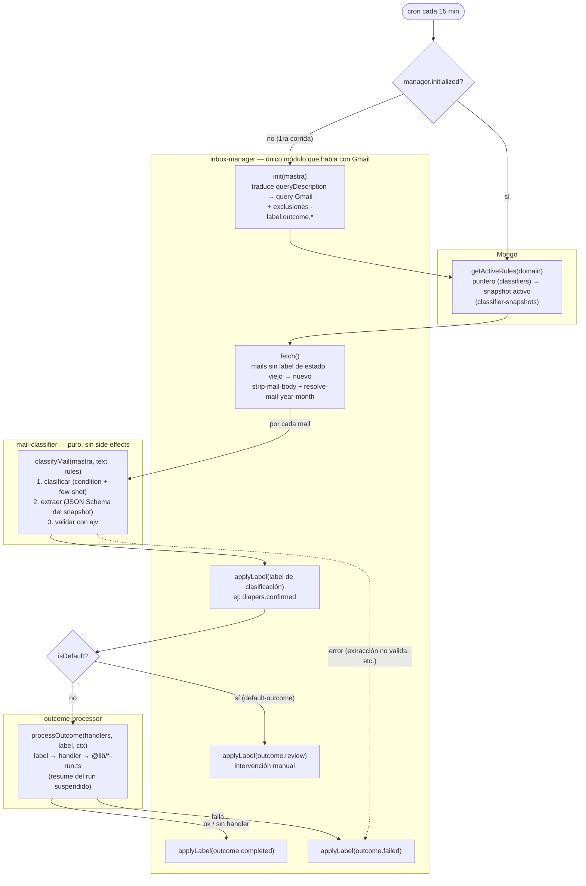

# Inbox pipeline: inbox-manager, mail-classifier, outcome-processor

Cada dominio (diapers, meds, refunds) tiene un poll workflow que corre cada 15 minutos y procesa
las respuestas de los proveedores en la casilla de Mostro. El pipeline se compone de tres módulos
independientes, orquestados por el step de cada poll workflow — ninguno conoce a los otros dos.

## La idea, sin tecnicismos



Cada mail queda etiquetado en el Gmail de Mostro con dos cosas: **qué era** (ej: "confirmación
de pañales") y **cómo terminó** (procesado, fallido, o a revisar). Un mail sin etiqueta de
resultado se vuelve a intentar en la próxima pasada — nada se pierde en silencio.

Las "reglas" que le dicen a Mostro qué tipos de respuesta existen y qué datos sacar de cada una
no están en el código: se cargan aparte y se pueden cambiar sin tocar el programa.

## El pipeline en detalle



Los rombos (`initialized?`, `isDefault?`) son decisiones del step orquestador
(`poll-<domain>-mailbox.step`); los módulos no se conocen entre sí.

## inbox-manager (`src/mastra/lib/inbox-manager/`)

Gateway a Gmail: lee mails y aplica labels. No clasifica ni ejecuta side effects.

- **Config en código** por dominio (`workflows/<domain>-poll/<domain>-inbox.config.ts`): solo un
  `queryDescription` en lenguaje natural ("mails del proveedor de pañales de los últimos 30 días").
- **Patrón `const` + `init(mastra)` idempotente**: la instancia se declara a nivel de módulo
  (donde `mastra` todavía no existe); `init(mastra)` traduce la query natural → sintaxis de Gmail
  con una llamada al agente `inboxClassifier` **una sola vez**, y los ciclos de cron siguientes la
  reusan.
- **Exclusiones estáticas**: a la query traducida se le concatena
  `-label:outcome.completed -label:outcome.failed -label:outcome.review`. Mail sin label de
  estado = no procesado. Las exclusiones no dependen de las reglas de clasificación, así que no
  hay que derivarlas de Mongo.
- `fetch()`: lista mensajes (Gmail devuelve de más nuevo a más viejo; se invierte para procesar
  de más viejo a más nuevo), limpia el cuerpo (`strip-mail-body`: cheerio para HTML,
  `email-reply-parser` para citas) y resuelve el `yearMonth` determinístico desde el header
  `X-Received` más viejo (`resolve-mail-year-month`).
- `applyLabel(messageId, label)`: crea el label en Gmail si no existe.

## mail-classifier (`src/mastra/lib/mail-classifier/`)

Funciones puras sobre texto + reglas: sin Gmail, sin side effects, sin cache.

- **Las reglas viven en Mongo** (no en código) y se leen en **cada corrida** vía
  `classifierRepository.getActiveRules(domain)`. Publicar un snapshot nuevo impacta en el
  siguiente ciclo de cron sin redeploy.
- `classifyMail(mastra, text, rules)` → `{ label, data?, isDefault }`:
  1. **Clasificación**: prompt con el `condition` de cada outcome + few-shot de
     `examples.match[]` / `examples.no_match[]`; el LLM elige exactamente un label
     (enum = labels de outcomes + label del default-outcome).
  2. **Extracción** (solo si el outcome elegido tiene `extract`): segunda llamada con
     `structuredOutput` pasando el **JSON Schema puro** del snapshot directo al LLM.
  3. **Validación**: `ajv` valida la data extraída contra ese mismo schema. Si no valida, se
     lanza error y el step marca el mail `outcome.failed` — la red de seguridad antes de tocar
     un workflow.
- El formato del JSON de reglas está documentado en [clasificador.md](clasificador.md).

## outcome-processor (`src/mastra/lib/outcome-processor/`)

Ejecuta el side effect asociado a un label de clasificación.

- **Registro en código por dominio** (`workflows/<domain>-poll/<domain>-outcome-handlers.ts`):
  mapa `label → handler`. Los handlers parsean `data` con los Zod resume schemas del dominio y
  llaman a los helpers `@lib/*-run.ts` (resume guardado por run + suspended + step correcto).
- `processOutcome(handlers, label, ctx)` → `{ ok } | { ok: false, reason }`. Un label **sin
  handler registrado** se considera completado sin side effects.
- ⚠️ Los labels del mapa **deben coincidir** con los del JSON seedeado en Mongo: un label
  clasificado que no figura en el registro queda `outcome.completed` sin ejecutar nada.

## Labels: dos dimensiones ortogonales

Cada mail procesado recibe dos labels con notación de punto:

| Dimensión | Ejemplos | Cuándo se aplica |
| --- | --- | --- |
| **Clasificación** | `diapers.confirmed`, `meds.unknown` | Apenas el LLM clasifica (viene del snapshot de Mongo) |
| **Estado** | `outcome.completed` / `outcome.failed` / `outcome.review` | Según el resultado del procesamiento |

- `outcome.completed`: handler OK (o label sin handler).
- `outcome.failed`: handler falló, extracción no validó, o error inesperado (best-effort).
- `outcome.review`: matcheó el default-outcome — intervención manual, nadie lo reintenta.

Un mail puede quedar `diapers.confirmed` + `outcome.failed`: se sabe **qué era** y **que falló**.
Como la query excluye los tres labels de estado, la semántica de reintento es at-least-once: un
crash antes de etiquetar el estado hace que el mail se reprocese en el ciclo siguiente.

## Reglas en Mongo: snapshots versionados

Dos colecciones (modelos en `src/business/models/`, repo en
`src/business/repositories/classifier.repository.ts`):

- **`classifier-snapshots`** (inmutable): `{ domain, version, author, changelog,
  classification_rules }`, índice único `(domain, version)`. Publicar cambios siempre crea una
  versión nueva (`version = max + 1`).
- **`classifiers`** (puntero mutable): `{ domain, version }`, índice único por `domain`. Apunta
  al snapshot activo. Rollback = mover el puntero a una versión anterior.

### Seed

Los JSON de reglas contienen datos sensibles y viven **fuera del repo**. Hay templates con
placeholders por dominio en [classifier-rules/](classifier-rules/) (labels y schemas de extract
ya alineados con los handlers). El script recibe el path:

```bash
pnpm seed:classifier -- --domain diapers --file /ruta/externa/diapers-rules.json --author "Alex" --changelog "seed inicial"
```

Valida el shape mínimo (outcomes no vacío, default-outcome presente), inserta el snapshot con
versión autoincremental y mueve el puntero.

## Orquestación (poll step)

`workflows/<domain>-poll/steps/poll-<domain>-mailbox.step.ts`, uno por dominio (sin factory
genérico, KISS):

```
si !manager.initialized → manager.init(mastra)          // traduce query una vez
rules = classifierRepository.getActiveRules(domain)     // Mongo, cada corrida
mails = manager.fetch()                                 // viejo → nuevo
por cada mail:
    { label, data, isDefault } = classifyMail(...)
    applyLabel(mail, label)                             // clasificación, inmediato
    si isDefault → applyLabel(mail, outcome.review); continuar
    result = processOutcome(handlers, label, { mastra, text, yearMonth, data })
    applyLabel(mail, result.ok ? outcome.completed : outcome.failed)
en catch (por mail): log + applyLabel(outcome.failed) best-effort — un mail roto no corta el loop
```

**Por qué clasificación y avance de workflow están separados**: el modelo solo responde "qué es
este mail" y "con qué datos" — nunca decide qué run o step tocar. Eso queda en código
(`resolveMailYearMonth` + los resume helpers `*-run.ts`), así que una mala clasificación puede, a
lo sumo, mal etiquetar un mail; no puede corromper el estado de un run.

## Notas operativas

- El scope `gmail.modify` es necesario para leer respuestas y aplicar labels (ver README, setup
  de Gmail).
- **Mails viejos con el esquema de labels anterior** (`mostro/...`) no tienen labels `outcome.*`,
  así que la query nueva los volvería a traer. La query natural limita a "últimos 30 días"; si
  molesta, aplicarles un label `outcome.*` manualmente en Gmail una vez.
- No hay retry automático de mails fallidos ni aviso por Telegram cuando algo cae en
  `outcome.failed` / `outcome.review` — pendientes en `docs/superpowers/followups.md`.
- **Limitación conocida**: la resolución por `X-Received` asume que el run de ese year-month sigue
  suspendido cuando llega la respuesta. Si ya hay un pedido nuevo del mes siguiente cuando aparece
  una respuesta tardía del mes anterior, la resolución sigue siendo correcta (apunta al mes del
  mail), pero el fix real para cruces de threads es atar cada thread de mail al run que lo originó
  (guardar el `threadId` del mail saliente en el estado del workflow) — no implementado.
- El CLI de dry-run (`classify:eml`) se eliminó con esta arquitectura; se rehará contra los
  módulos nuevos en otra tanda.
